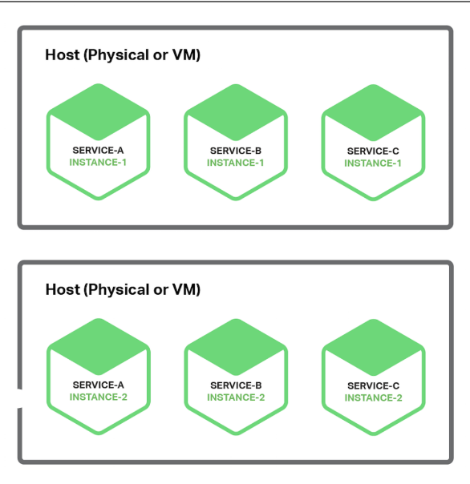

### Questions from “Type of Machines” 
- A virtual machine is a virtual environment that simulates a physical machine. For a VM’s advantages, they are fast to create and 
destroy, meaning there is very little lead time between when one is requested and when it is usable. They are also able to be controlled
through software, meaning that their manipulation can be done on a large scale. Ultimately, they allow for multiple environments to 
exist on the same machine, and therefore can go beyond the limitations of hardware. 

- A container is a group of processes running on an OS that are isolated from other groups. The advantages of containers are they are
much less wasteful than VM’s, because they consume resources at a fine-grained level, they are unable to have dependency or version 
conflicts with each other, and they are also very lightweight since they don’t require an entire OS.

- It may be beneficial to choose a physical machine over a virtual machine when performance is the most important aspect and there 
are no privacy concerns about the data. 

### How can cloud aid microservices?
Microservices are one of the architectural approaches to create cloud applications. The cloud is an ideal way to deploy microservices
because there is the ability to use multiple services instances per host pattern for a given service. A diagram of this is shown below. 
When doing this with cloud, it is possible to use cloud instances as the governer. 

